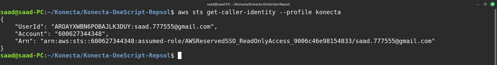
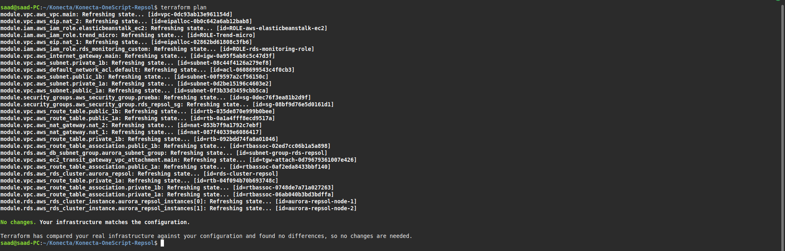
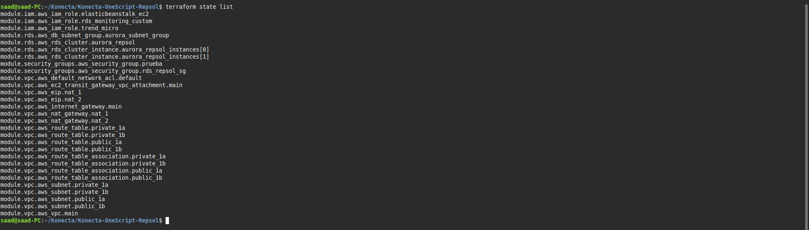

# Konecta OneScript Repsol - AWS Infrastructure Import

## What We Did

Imported existing AWS infrastructure into Terraform management using Infrastructure as Code principles. Successfully brought 29 AWS resources under Terraform control.

## Project Structure
Konecta-OneScript-Repsol/
├── images/ # Screenshots and documentation images
├── modules/
│ ├── vpc/ # Network infrastructure (20 resources)
│ ├── rds/ # Database resources (4 resources)
│ ├── security_groups/ # Security configurations (2 resources)
│ └── iam/ # Service roles (3 resources)
├── main.tf # Root configuration
├── variables.tf # Input variables
├── outputs.tf # Outputs
├── .terraform.lock.hcl # Provider versions
└── README.md # This file
## Resources Imported (29 Total)

**VPC Module (20 resources)**
- 1 VPC, 4 Subnets, 1 Internet Gateway
- 2 NAT Gateways + 2 Elastic IPs  
- 4 Route Tables + 4 Route Table Associations
- 1 Default Network ACL, 1 Transit Gateway VPC Attachment

**RDS Module (4 resources)**
- 1 Aurora PostgreSQL Cluster
- 2 DB Instances (Writer + Reader), 1 DB Subnet Group

**Security Groups Module (2 resources)**
- 1 Application Security Group, 1 RDS Security Group

**IAM Module (3 resources)**
- 1 Trend Micro Role, 1 Elastic Beanstalk Role, 1 RDS Monitoring Role

## Import Process

1. **Discovery**: Used AWS CLI to find all user-created resources
2. **Module Design**: Organized resources into logical modules
3. **Configuration**: Wrote Terraform code to match existing resources
4. **Import**: Imported resources using terraform import commands
5. **Validation**: Verified zero drift with terraform plan

## Verification Results

### AWS Account Verification

### Zero Configuration Drift

### Complete Resource Management

## Result

- ✅ All 29 resources successfully imported
- ✅ Perfect state synchronization 
- ✅ Infrastructure now managed as code

**Region**: eu-west-1 | **Main VPC**: vpc-0dc93ab13e961154d | **Database**: Aurora PostgreSQL HA cluster